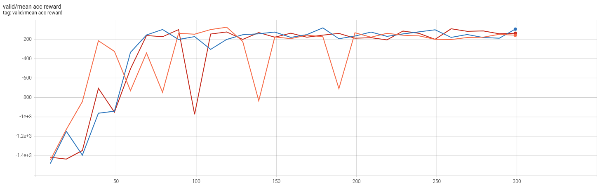

# OpenAI Gym Pendulum solutions

## DDPG

- training code: `train-ddpg.py`

### training result

the following figure shows three training sessions results. for each validation step, environment was reset for 5 times and the accumulated rewards was averaged.

